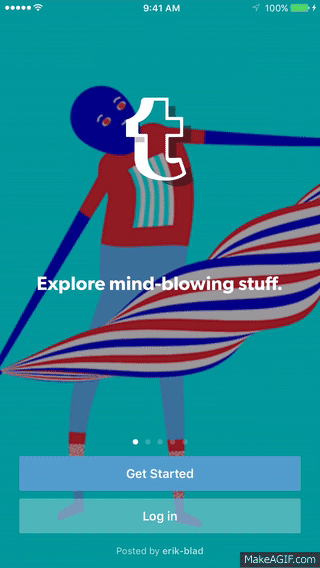
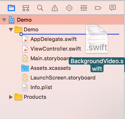
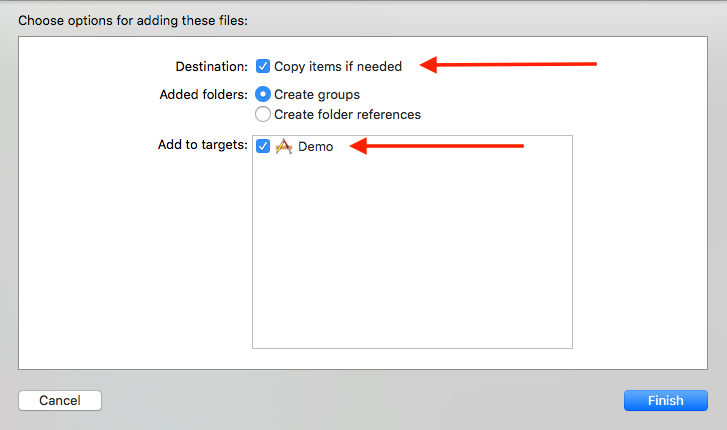

# BackgroundVideoiOS
#### *This is an Object/Class which lets you add a video background to iOS app views. This is seen at login views of some famous apps like Spotify, tumbler and Vimeo*

##### This is how they look.. 

  

##### It does the following: 
* *Creates an AVPlayer object for you and plays a video from your app bundle*

* *Handles video looping*

* *Handles app going to background and coming back to foreground*

* *Handles seguing away and back again to the view that plays the video*

* *Mutes the video and does not allow it to interrupt other audio services. For example, it does not stop music playing from your music app or a VoIP call*

##### Instructions:
* Have an awesome video that you want to show as your background 
* Drag and drop **`BackgroundVideo.swift`** file to your Project navigator

  
* Drag and drop the video to your project and make sure to check **`Copy items if needed`** as well as **`Add to targets`** (This is because the object will look at your app's main bunddle)

   
* Go to the view controller where you want to display the video and declare an instance.

```swift
var backgroundPlayer : BackgroundVideo? // Declare an instance of BackgroundVideo called backgroundPlayer
``` 

* In your **`viewDidLoad()`** function, initialize your instance with the view controller you're using and the name of the `video file with it's extension` as parameters (make sure you seperate your name and extension by a period). In the following code I'm passing the same view controller where I declared my instance, namely **`self`**. Then, just call the function **`setUpBackground()`** on your instance.

```swift
 override func viewDidLoad() {
        super.viewDidLoad()
        // Initializing your instance 
        backgroundPlayer = BackgroundVideo(onViewController: self, withVideoURL: "test.mp4") // Passing self and video name with extension
        backgroundPlayer?.setUpBackground() 
    }
```

##### That's it, you're ready to go :)!
