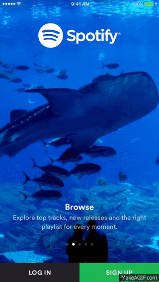

# BackgroundVideo-iOS
#### *This is a class which lets you add a video background to iOS app views. This is seen at login views of famous apps like spotify, tumbler and Vimeo*
#####This is how they look like.. 
  
##### It does the following: 
-*Creates an AVPlayer object for you and plays a video from your app bundle*

-*Handles app going to background and coming back to foreground*

-*Handles seguing away and back again to the view that plays the video*

-*Mutes the video as well as does not allow it to interrupt other audio services. For example, it does not stop music playing from your music app*
